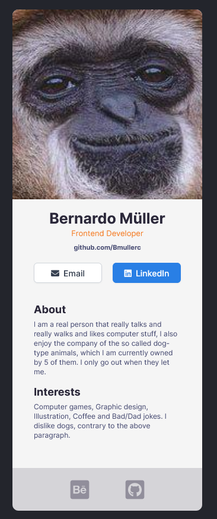

### Challenge
This is a challenge from a Scrimba React class, the objective was to build a digital business card as close to the example as possible, while using React.

### Built with
- React
- SASS
- BEM

## Screenshot

## Live Site

[Live Site](https://digital-business-card123.netlify.app/)

## Thoughts and/or What I've learned

- Not really confortable using my own picture, just not that type of person
- Still grasping the basics of React, but feeling confortable and liking it a lot so far
- SASS and BEM became pretty much second nature by now
- Create React is easy to use, thought I would have trouble with Netlify or even Github uploading, but its very easy
- I always forget about Fontawesome and end up going through the trouble of adding SVG's and changing colors when I could just simply add the icon with a simple tag and link import...

## Going forward

- Getting deeper with React and Javascript, still too soon for Typescript, React Native and Redux
- Starting a big React project to maybe add to my portfolio
